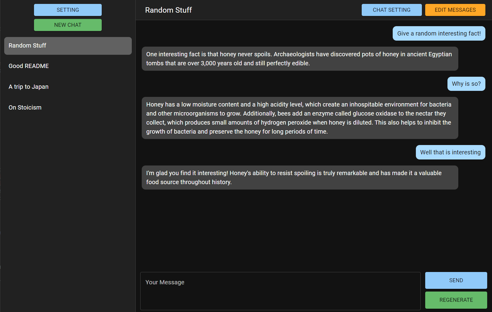
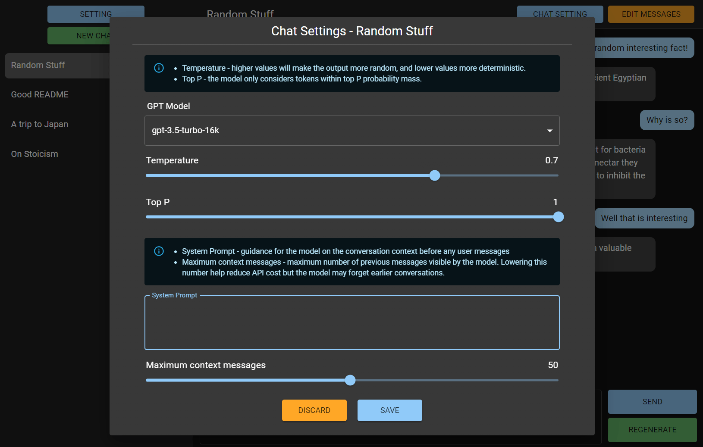

# DialogCraft

<p align="center">
  
</p>

DialogCraft is an application built to interact seamlessly with OpenAI's Chat APIs. It provides a user-friendly interface to manage and control your conversations with AI, all from the comfort of your PC, without involving any third-party services.

<div align="center">
    
    
    
</div>

## Start Using

You can start using the [web version](https://dialogcraft.hayden.life) of DialogCraft right now. For best performance and maximum security, consider downloading the desktop app.

## Download

To download the desktop version of DialogCraft, visit the [release page](https://github.com/Hayden2018/dialogcraft/releases) on GitHub to download the installer. It is available for Windows and Ubuntu at the moment.

## Features

DialogCraft offers a range of features:

- **Local Storage**: Your API credentials are stored securely on your local machine, and the app communicates directly with OpenAI's endpoints.
- **Conversation Control**: You have full control over your conversation history. You can edit or delete messages from both user and bots. You can also regenerate responses with a single click.
- **Customizability**: Switch between all available models in your OpenAI account, with full control over parameters such as temperature and top P. You can also set the maximum context messages for cost efficiency. Choose between dark and light modes based on your preference.
- **Import/Export**: You can import and export your chat history in JSON format if you are using the desktop app.

## Technology

DialogCraft is built using React with Redux-Saga + Material UI for the user interface and Electron for desktop integration.

## Getting Started

Before you begin, make sure you have NodeJS installed on your system.

To start working with DialogCraft, clone the repository and follow the steps below:

```bash
npm install # Install dependencies
npm start # Start React development server
npm run electron-dev # Run this command after npm start for electron development
```

To build the app for your system:

```bash
npm run make # Electron forge will build for your platform
```

## Contribution
Contributions or feature requests are welcomed. Feel free to create a Merge Request or [contact](mailto:yikhei123@gmail.com) the author.
